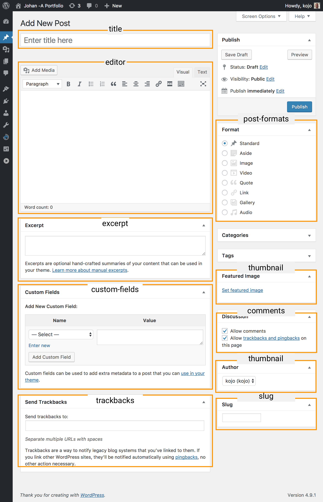
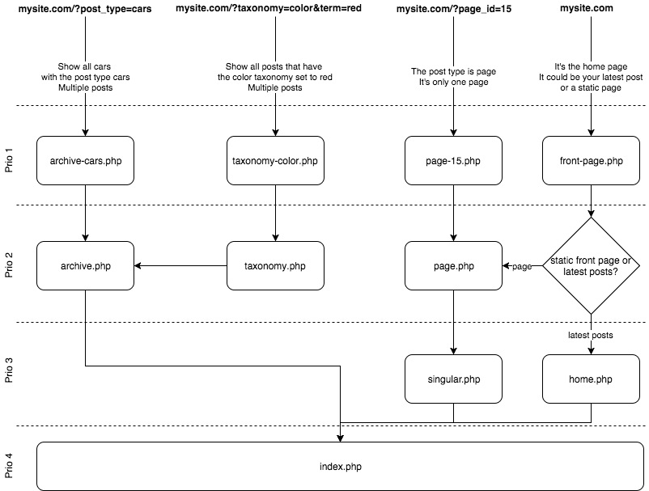

# Wordpress study questions

Knowing the following should be sufficient to pass the Wordpress part of the exam. To learn more [study the entire Wordpress tutorial](https://school-of-engineering.github.io/wordpress-basics/). 

> Version 1, finished.

1. What is Wordpress?

   > Wordpress is a Content Management System (CMS)  written in PHP which is used for *creating, managing and serving content*. You install it on a web server running Apache (or nginX) with PHP and MySQL.


2. How can you increase security in Wordpress?

   > Keep Wordpress, themes, and plugins up-to-date.
   >
   > You can also use security plugins that tightens up security in areas where WP is known for its weak spots.

3. What can you do in the Admin Dashboard?

   > Add new posts and pages
   >
   > Upload images and other Media,
   >
   > Change Theme and install plugins.
   >
   > Create and manage menus
   >
   > Manage site wide settings
   >
   > Manage user accounts

4. What is a Wordpress post?

   > Simply put, it's a row in the database table wp_posts. Posts are the most central part of the Content Management System. Posts hold (pretty much) all the content. There are five built in post types each of which have different uses.

5. What are post types?

   > every post in wp_posts have one of five default post types:
   >
   > | name          | used for                                 |
   > | ------------- | ---------------------------------------- |
   > | post          | non hierarchical content (blog entries, news, etc.) |
   > | page          | hierarchical content (web pages)         |
   > | attachment    | files and media (information for a specific data file) |
   > | revision      | autosaved post versions                  |
   > | nav_menu_item | custom menu items                        |

6. When would you need a custom post type?

   > If for instance  ***Posts*** or ***Pages*** doesn't describe your content well enough you might want to add a new post type.
   >
   > If you own a kennel, you might want to add ***Dogs*** to your site.
   >
   > Instead of a New post, you'd want to add a New ***Car***, if you were a car dealer.
   >
   > Or if you run a food blog, you might want to add ***Recipes*** in addition to posts and pages.

7. In what way can you customise a post type?

   > When you register a new Custom Post Type, there are a few things you can configure:
   >
   > | Option       | Description                              |
   > | ------------ | ---------------------------------------- |
   > | Labels       | What the post type is called in different areas of the admin dashboard |
   > | Show in menu | If the post type should have its' own section in the admin dashboard menu. |
   > | Menu icon    | The icon to use in the admin dashboard.  |
   > | Hierarchical | Set this to `TRUE` for content that could have parents, like Places: Asia>Japan>Tokyo |
   > | Supports     | Which default content  fields to show in admin dashboard for posts with this type. See next question. for examples |

8. When registering a new Custom post type, you can define an array of features to support
   ('supports' => *$supports_array*). What could those be?

   > `title, editor, excerpt, thumbnail, custom-fields, trackbacks, comments, slug, author`
   >
   > 

9. What are Taxonomies and terms?

   > *Category* and *Tag* are the two built in taxonomies in Wordpress. Taxonomies are words that describe a classification. Terms are the actual classifications. Look at these examples to better understand:
   >
   > | Taxonomy | Term                             |
   > | -------- | -------------------------------- |
   > | Gender   | Male, Female                     |
   > | Language | Swedish, English, German, French |
   > | Species  | Cat, Dog, Horse, Cow             |
   > By looking at the examples above you might realize that there could be a need for other taxonomies than Category and Tag. You can register your own taxonomies with a function called register_taxonomy()

10. What is a theme?

  > The theme is the head piece of a Wordpress installation. Without it Wordpress doesn't work. 
  >
  > A theme consists of the following parts: 
  >
  > - A stylesheet (style.css) that define the design and layout of the templates. At the top of the stylesheet file there is a comment area where you set the Theme name.
  > - A configurations file (functions.php) where you edit the functionality in Wordpress. Here you register new post types and taxonomies, add widget areas, create menu locations and define which features Wordpress should utilise.
  > - Templates files contains the HTML structure of your site combined with functions to output content from the database. Based on the requested URL, Wordpress figures out what type of content is requested and choses the corresponding template file if it exists. 
  >
  >   *Note that functions.php isn't required to create a theme, only style.css and index.php.*

11. How does Wordpress know which template to use?

    > Even though you are using pretty permalinks, there is a translation happening behind the curtains. Before Wordpress receives the requested (friendly) URL, it is being translated via a .htaccess file on your server to 
    >
    > 1: **mysite.com/cars/** is actually **mysite.com/index.php?post_type=cars**
    >
    > `SELECT * FROM wp_posts WHERE post_type='cars'`
    >
    > 2: **mysite.com/about** is actually **mysite.com/index.html?page_id=15**
    >
    > `SELECT * FROM wp_posts WHERE ID=15` 
    >
    > 3: **mysite.com/color/red** is actually  **mysite.com/index.php?taxonomy=color&term=red** 
    >
    > ```
    > SELECT t.*, tt.*
    > FROM wp_terms AS t 
    > INNER JOIN wp_term_taxonomy AS tt
    > ON t.term_id = tt.term_id
    > WHERE tt.taxonomy IN ('color')
    > AND t.slug = 'red'
    >
    > # From this we know that term_taxonomy_id = 7
    >
    > SELECT SQL_CALC_FOUND_ROWS wp_posts.ID
    > FROM wp_posts 
    > LEFT JOIN wp_term_relationships
    > ON (wp_posts.ID = wp_term_relationships.object_id)
    > WHERE 1=1 
    > AND ( wp_term_relationships.term_taxonomy_id IN (7) )
    > AND wp_posts.post_type = 'car')
    > GROUP BY wp_posts.ID
    > ```
    >
    > Ok, this quickly became nerdy, but it's just to show you that it's not magic that Wordpress knows what post or posts to display.
    >
    > In example 1 and 3 we can expect to have more than one post as the result, hence Wordpress will try to use one of the archive template files that it recognises.
    >
    > In example 2 the result is always one specific post, hence use one of the singular templates (in this example it's **page_id**=, so WP knows it's a page ).
    >
    > To figure out which template file to use, Wordpress follows a strict hierarchy scheme of predefined template file names. Here's a simplified version of it, based on the above requested URL's
    >
    > 
    >
    > As you can see from this diagram, if the only template available is index.php, all content will be displayed using that template. You can also see that there are different priorities on the different template files. If a template with priority 1 exists that template file will be used before a template with a lower priority.

12. What is the loop and how does it work?

    > Iterating through the array of post objects is commonly referred to as *The Loop*. The two main methods used for creating the post loop are **have_posts()** and **the_post()**. 
    >
    > **have_posts()**
    > Will return *true* as long as the current query object has posts in it. 
    >
    > **the_post()** 
    >
    > Used inside the loop to set up the current post object. This exposes methods (aka template tags) we can use to directly access the data fields of that post. *It also tells the the loop to iterate one step forward.*
    >
    > ```php
    > if(have_posts()):
    >     while ( have_posts():
    >         the_post();
    >         //Combine HTML elements with template tags
    >     endwhile;
    > else:
    >     // something wrong, no posts
    > endif;
    > ```
    >
    > Using this structure makes sure you always display all posts in the query object. If you know you'll only have one post, `the_post()` is the only method you need to call to load the template tags.

13. What are template tags?

    > The so called template tags are methods to echo or return data from the query object. Or in other words, the content from the different fields from the post (se figure at 8) 
    >
    > Template tags starting with **the_** will always echo something out. In some cases just a string and in some cases an entire HTML tag. Here are some useful examples
    >
    > | method                                | output                                   |
    > | ------------------------------------- | ---------------------------------------- |
    > | the_title()                           | the post title                           |
    > | the_content()                         | Everything inside the Content editor     |
    > | the_excerpt()                         | The first 55 words of the Content (without any HTML markup) |
    > | the_id()                              | the post id from the wp_posts database table |
    > | the_permalink()                       | the absolute link to the post (useful on an archive page) |
    > | the_post_thumbnail('media_size_name') | echoes out an entire img element with the selected thumbnail size. |
    > Template tags starting with **get_** returns previously mentioned as php values. No echoing.
    >
    > `echo get_the_title()` has the same effect as `the_title()`.

14. How can you modify the Wordpress query and the loop?

    > You can make your own database query by passing in an array of query vars when instantiating a copy of the Wordpress query object. 
    >
    > Here is an example selecting all posts that has the post type *car* and sort them by their *title*.
    >
    > ```php
    > /** 
    > * This is what we want to find in the database. 
    > * All posts with the post_type car
    > * ordered by their title
    > */
    > $query_vars = array(
    >   'post_type' => 'car',
    >   'orderby' => 'title'
    > );
    >
    > /**
    > * Create an object containing the database results 
    > * from the query we pass to it. 
    > */
    > $my_query = new WP_Query($query_vars);
    >
    > /**
    > * The loop needs to be modified to check if 
    > * OUR result have any posts. Then 
    > * load the template tags with 
    > * posts from OUR query.
    > */
    > if( $my_query->have_posts() ) {
    >   while ( $my_query->have_posts() ) {
    >     $my_query->the_post();
    >     /* List all cars sorted by the title */
    >   }
    > } else {
    >   /* No cars found */
    > }
    > ```
    > [Here's a good explanation of some of the most common query vars](https://gist.github.com/ancillaryfactory/2033357) 

15. Why do you divide the templates into different parts?

    > The reason for dividing your template files into different part is to avoid redundant code. 
    >
    > If you have 4 different templates (page, single, archive and 404.php) then you will probably have the same header and footer in all of those templates. 
    >

16. How do you include files using Wordpress methods?
    >
    > By default, Wordpress will recognise header.php, footer.php and sidebar.php as template parts. They even have their own include methods: `get_header()`, `get_footer()` and `get_sidebar()`.
    >
    > By including header.php and footer.php inside your 4 template files you save a bunch of code lines and more importantly, if you wish to change something in the header or footer, you only need to do it in one place. 
    >
    > Of course you're not limited to dividing your template files into only these files. You can include more files using either the PHP default methods like include() or require() but there is also a Wordpress method available called get_template_part() in which you don't specify the file extension:
    >
    > `get_template_part('postgrid')` would include postgrid.php. You can also add a second parameter,  a variant suffix: ` get_template_part('postgrid', 'custom')` which would include postgrid-custom.php if it exists, else it would include postgrid.php as a fallback. 

17. What are hooks?

    > Throughout the timeline of loading a page in Wordpress, more than 20 000 function calles are made. The majority of these functions have so called hooks added to them. These hooks let theme developers add their own function calls at certain points to modify the built in methods.
    >
    > If you know the name of a Wordpress method, there is most certainly a hook with that same name as well. 
    >
    > You could compare hooks to JavaScript's `element.addEventListener('click', sayHello)` . In that example the function sayHello would run when someone clicks. 
    >
    > There are two types of hooks in Wordpress; action hooks and filter hooks

18. What is an action hook?

    > Action hooks lets you que a function to be called at a certain point (there are more than 800 action hooks in Wordpress). The host function of the hook doesn't pass data to your function it will just call it. Use it to echo out code or change global variables.
    >
    > You've been using the init hook to add post types and taxonomies.
    >
    > For instance, if you want to run a function before footer.php is loaded you can add a function to the hook `get_footer` 
    >
    > This example echoes an `<hr>` element when the get_footer() method is called:
    >
    > ```php
    > function add_hr() {
    >   echo '<hr>';
    > }
    >
    > add_action('get_footer', 'add_hr');
    > ```
    >

19. What is a filter hook?

    > Filter hooks looks very similar to action hooks, but unlike action hooks they will pass data to your function as an argument. There are more than 1700 filter hooks in Wordpress that lets you modify the data before it is echoed out. A
    >
    > Although you can, your function shouldn't echo anything, just return the value it received in a modified way.
    >
    > This example hooks a function to the filter hook `the_title` and makes all titles uppercase:
    >
    > ```php
    > function make_uppercase($input) {
    >   $output = strtoupper($input);
    >   return $output;
    > }
    >
    > add_filter('the_title', 'make_uppercase');
    > ```
